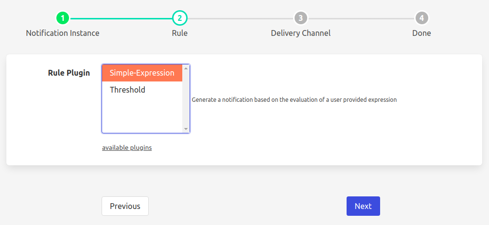
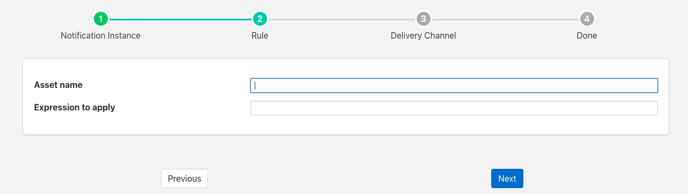

.. Images

.. |exprtk| raw:: html

   <a href="http://www.partow.net/programming/exprtk/index.html">ExprTk</a>

.. |fledge-south-expression| raw:: html

   <a href="../fledge-south-Expression/index.html">fledge-south-expression</a>

.. |fledge-filter-threshold| raw:: html

   <a href="../fledge-filter-threshold/index.html">fledge-filter-threshold</a>

.. |fledge-filter-expression| raw:: html

   <a href="../fledge-filter-expression/index.html">fledge-filter-expression</a>

Expression Rule
===============

The *fledge-rule-simple-expression* is a notification rule plugin that evaluates a user defined function to determine if a notification has triggered or not. The rule will work with a single asset, but does allow access to all the data points within the asset. If it is required to work with data from multiple assets it is recommended to use a filter to create a new asset that has all the data from all the assets required by the function you wish to evaluate.

During the configuration of a notification use the screen presented to choose the simple expression plugin as the rule.

+----------------+
| |expression_1| |
+----------------+

The next screen you are presented with provides the configuration options for the rule.

+----------------+
| |expression_2| |
+----------------+

The *Asset* entry field is used to define the single asset that the plugin should monitor.

The *Expression to apply* defines the expression that will be evaluated each time the rule is checked. This should be a boolean expression that returns true when the rule is considered to have triggered. Each data point within the asset will become a symbol in the expression, therefore if your asset contains a data point called voltage, the symbol voltage can be used in the expression to obtain the current voltage reading. As an example to create an under voltage notification if the voltage falls below 48 volts, the expression to use would be;

.. code-block:: console

   voltage < 48

The trigger expression uses the same expression mechanism, |exprtk|  as the
|fledge-south-expression|, |fledge-filter-expression| and |fledge-filter-threshold| plugins

Expression may contain any of the following...

  - Mathematical operators (+, -, \*, /, %, ^)

  - Functions (min, max, avg, sum, abs, ceil, floor, round, roundn, exp, log, log10, logn, pow, root, sqrt, clamp, inrange, swap)

  - Trigonometry (sin, cos, tan, acos, asin, atan, atan2, cosh, cot, csc, sec, sinh, tanh, d2r, r2d, d2g, g2d, hyp)

  - Equalities & Inequalities (=, ==, <>, !=, <, <=, >, >=)

  - Logical operators (and, nand, nor, not, or, xor, xnor, mand, mor)

Using the example above, but this time assume we want to trigger an alarm when the power consumption goes about 150 Watts. However we do not monitor power consumption, just voltage and current. We can easily calculate the power consumption from the voltage and current.

.. code-block:: console

   voltage * current > 150

Multiple expressions may be matched using the logical operators. Assume we measure temperature in three locations on a lathe, the headstock bearing, the tailstock bearing and the cutting tool. We want to raise a temperature alert if either of the bearing temperatures exceeds 30 degrees or the cutting tool exceeds 40 degrees. We can write an expression for this as

.. code-block:: console

   headstock > 30 or tailstock > 30 or tool > 40

Brackets may be used to influence the order of evaluation of the expression. If we change the above logic to be that we alert if both bearings are over 30 degrees or the tool is over 40 degrees, the expression becomes

.. code-block:: console

   (headstock > 30 and tailstock > 30) or tool > 40

Other logical operators may be used, for example *nor* if we wanted to constructed a rule that trigger if neither of a pair of conditions holds true.

.. code-block:: console

   voltage < 115 nor current < 1.5

This rule will trigger only if the current is 1.5 or greater and the voltage is 115 or higher. It is possible to rewrite this expression using the *and* operator, but it may be clearer to use the *nor* operator.

It is also possible to apply functions to values in these expressions. For example if we assume we have a single that can take both positive and negative values, but we wish to alert if the value of that single is greater than 1.0 or less than -1.0, we can simply use the *abs()* function.

.. code-block:: console

   abs(signal) > 1.0

Time based expressions
----------------------

The plugin itself is designed to operate on individual readings rather than a set of readings taken over a period of time. Whilst this may appear as a limitation initially there are ways this can be overcome.

The simplest approach is to run the rule against processed data rather than a single reading, for example using the statistical filter in an ingest pipeline to feed statistical data rather than raw data into the rule for evaluation.
